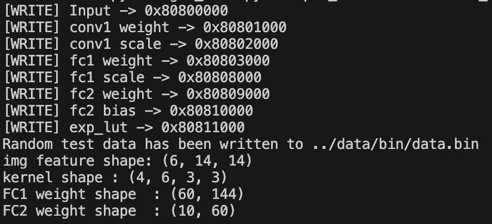

# EE219 2025 Fall Final Project
## Introduction
This project is designed to allow you to apply what you have learned throughout this course. It provides an opportunity to design your own AI computing system, which includes model training, model quantization, hardware design and operator development. Bon Voyage!

## Project Goal
The goal of this project is to design an AI computing system that enables computational acceleration of a neural network. The system is divided into three levels: **neural network**, **hardware platform** and **application software**. The basic requirement is to deploy the whole network and ensure that the simulation results running on hardware are consistent with those running in Python.


### Neural Networks
You need to analyze the characteristics of different network layers (such as memory-intensive or computation-intensive) and the data layout format during storage. To reduce simulation runtime and avoid repetitive work, we selected several representative data operations from neural networks to implement.
### Hardware Platform
Based on the knowledge of designing an accelerator for Conv2D using a systolic array from [Lab 3](../lab3/) and understanding the structure of a general-purpose processor like the RISC-V32IMV processor from [Lab 4](../lab4/), design a custom hardware computing platform to deploy your neural network model.

### Application Software
Integrate the skills of using the numpy library in Python to build neural networks from [Lab 1](../lab1) and using assembly language for MAC operations from [Lab 4](../lab4/). Employ C + inline assembly to build the neural network arithmetic library and complete the corresponding software for your custom computing platform to ensure the correct operation of the neural network.

## Detailed Task
### Neural-Networks

You need to fully implement the operations listed in the table below

**Layer** | **Type** | **Input Shape** | **Output Shape** | **Input Data type** | **Output Data type** | **Weight Data type** | **Bias Data type** | **Activation**
---     | ---             | ---     | ---     | ---    | ---    | ---    | ---    | ---
conv    | Convolutional   | 6x14x14 | 4x12x12 | int 8  | int 16 | int 8  |        | ReLU 
pool    | Max pool        | 4x12x12 | 4x6x6   | int 16 | int 16 |        |        | None               
fc1     | Fully-connected | 180     | 60      | int 16 | int 32 | int 16 |        | ReLU                  
fc2     | Fully-connected | 60      | 10      | int 32 | int 32 | int 32 | int 32 | None                  
softmax |                 | 10      | 10      | int 32 | Q16.16 |        |        | None                  


You can refer to this [head file](./sw/include/model.h). If there is a need to cache the output results of intermediate layers, we also provide storage addresses for those in the same head file. You can change these output addresses if needed. Here are some reminders for your reference.


#### 1. NCHW v.s. NHWC ? 
The activations and weights of the convolutional layer are four-dimensional tensors stored in the `NCHW` format by default. However, in our previous [Lab 3](../lab3/), we found that the `NHWC` format may offer better memory access efficiency. Therefore, we provide you with the flexibility to choose. Please refer to the Line 8-11 in [Makefile](./Makefile), where `NCHW` storage is used by default. If you want to store inputs or weights in `NHWC` format, simply set them to `true`. Similarly, the activations and weights of the fully connected layers are two-dimensional tensors. You can modify the [Makefile](./Makefile) as needed to store transposed weights. Note that the shape of the data during storage will be printed in the terminal.

#### 2. Data Type of Softmax
Since our hardware platform only supports `Integer Instructions`, you can compute the softmax in a way similar to Lab 4.
In the test script, we provide a function that simulates hardware execution and directly prints the Q16.16 values representing the results. You can also refer to this function.
You can store and print the Q16.16 values representing the results just like our script does.
**As long as the overall trend of your results matches either the Python-computed results or the simulated hardware results in our test script, they will be considered correct.**

> Reminder: The input data type is int32 and the output is Q16.16. Therefore you need to left-shift the input value by 16 bits first.

#### 3. Scale
The result of `conv` and `fc1` should be divided by a scale to avoid data overflow. The address and data type of these two scales are described in [head file](./sw/include/model.h).

> Note: It you have better idea when calculating `softmax`, you can change the code below `# ========== gen exp lut ==========` in projects/project/tool/gen_data.py. But remember that the hw style softmax golden result depends on it. Therefore please modify it carefully.


### Hardware-Platform
Our hardware platform uses the RISC-V processor architecture and supports all RV64I instructions, along with some custom vector instructions. A single-cycle scalar processor core supporting RV64I has been implemented and is available for use.
However, the source code for this scalar processor core is obfuscated. The focus of your design will be on the vector processor and accelerator part of the platform.

The RV64I processor provides a `pc_stall` interface to pause the PC counter. You can embed a custom accelerator into the ALU of the vector processor, considering the large access bandwidth of the vector processor. This project does not require complex instructions for the vector processor, and you can use the code from [Lab 4](../lab4/) with simple modifications. However, to control the accelerator, you will need to add some custom vector instructions.

The accelerator architecture is not restricted, but you must provide reasonable justification for your design choices. For example, using an excessive number of registers or arithmetic units would not be acceptable. In short, your accelerator should be as efficient as possible while matching the access bandwidth. If you embed the accelerator in Lab3, the PE number should not be larger than 24*24=576 (or you may have an extremely slow simulation).

### Application-Software
Since our intelligent computing system is processor-based, we need software to control the processor and make it perform the desired operations. After completing the first two parts, you will need to build an operator library to support the specific computations of the neural network. Most of this can be done using C, but for sections involving vector instructions (including custom instructions), you will need to use inline assembly. [Sample programs](./sw/) will be provided to help you with both cases.

## Environment
### Additional Tool Installation
You must install the `gcc-riscv64-linux-gnu tool` first.
```bash
sudo apt install gcc-riscv64-linux-gnu
```
You can use the command to check if you has installed the tool successfully.
```bash
riscv64-linux-gnu-gcc --help
```
### Permission to Run Scripts
You need to add the execution permission to the `*.sh` file.
```bash
chmod +x -R EE219-AICS-2025/projects/project
```
### Conda Environment
To run the python code, you also need to activate the conda-environment torch.
```bash
conda activate torch
```
### Useful Extensions
- Binary Viewer


Since the data is saved as binary bin files, which are less readable, it is recommended to install this extension. When using it, simply select the `*.bin` file, right-click on it, and choose "Open As Hexadecimal View". 


You can choose the type of data display as `int8`. In the `offset`, you can fill in the hexadecimal address, and then you can quickly locate the data you want. 


- vscode-numpy-viewer


We have provided references for intermediate calculation results, which are saved in the `.npy` format and stored in the default `NCHW` storage mode. To view the data in the `*.npy` file intuitively, it is recommended to install this extension. After the installation is completed, you can simply click on the `*.npy` file to view it. 


## Useful Commands
### Make Clean First
We recommend clearing the temporary files before simulation.
```bash
make clean
```

### Parse Model
Running the following commands will automatically run the [script](./tool/data.py) that generate random data in the format shown in the table at the beginning of this file. It will display the number of parameters for the input, output, activation, and weights of each layer in the terminal, and save the input and parameters as `.bin` files. 

```bash
make data
```



### Run Simulation
The programs in your software part should be of the `*.c` type. When running the simulation, use its name as the value of `CFILE`. For example, the following commands are used to run different sample programs. The terminal displays the number of cycles required for the processor simulation.
``` bash
make run CFILE=demo1
make clean
make run CFILE=demo2
make clean
make run CFILE=hello-str
```


### RAM Reader for Debug
After the simulation is completed, the values in the memory at this time are saved as `./data/save.bin`. You can use the following script to print the values in the memory. The default main program in the script is to print 10 consecutive `int8` numbers starting from the address of `ADDR_INPUT` and 16 consecutive int16 numbers starting from the address of `ADDR_SAVE` after running `demo1`.  
```bash
cd tool
python ram_reader.py
```


## Score
In the competition, we will run the codes submitted by each group and rank them based on the number of cycles. Additionally, although this is a group project, code-level reference among groups is **not allowed**.

- Report (30%)
    - Hardware-Platform (15%)
    - Application-Software (15%)
- Code (HW + SW) (60%) * `SCALE` ()
    - Convolution (20%)
    - Pooling (15%)
    - FC (15%)
    - SOFTMAX (10%)
- Competition (10%)
- Bonus (+20%)


The method for `SCALE` is explained below:

| Hardware Design | SCALE | Points you can get in `Code (HW + SW)` part at most |
| --------------- | ----- | ------- |
| No RISC-V Vector or Accelerator (All computations are performed using the RV64I processor)                  | 1/6             | 10 |
| RISC-V Vector, no Accelerator | 1             | 60 |
| Accelerator | 1             | 60 |


If you implement accelerator in your design, you can get bonus:
| Which part can your accelerator speed up | Additional points  added to the total score |
| ----------| -- |
| CONV      | 10 |
| MAXPOOL   | 5  |
| FC        | 5  |

> NOTE: If the PE number you used in your design exceeds 576, your bonus score will be:
**final_bonus_score = original_bonus_score * (576 / n)**,
where **n** is your PE number.

## Submission
Using the make command to export the git log file and pack up the `project` folder. You will get the compressed file `project.tar.gz` in `EE219-AICS-2025/projects`.
``` bash
make pack
```
Please compress `project.tar.gz` and the report into a `zip` file with the name `{ID1_Name1_ID2_Name2...}_EE219_Project.zip`, and submit to Gradescope. The file structure should be like this.
```bash
2024123456_李华_2023987654_李雷_EE219_Project.zip
|-- report.pdf
|-- project.tar.gz
```
Please specify each group member’s contribution to this work at end of the report.